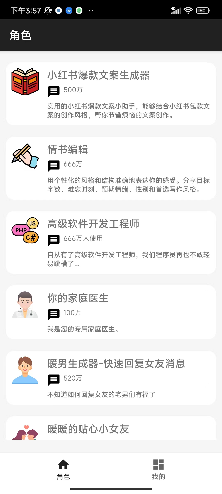

# BeAI开源项目说明文档

## 采用方案  

开发工具：Android Studio Flamingo | 2022.2.1 Patch1版本  

开发版本：gradle 8.0  

开发语言：Java  

云服务商：[Bmob后端云](https://www.bmobapp.com)，使用了数据服务和AI服务。  

## 前提条件  

建议不了解Bmob AI服务的朋友，先花几分钟查看[Bmob AI快速入门](https://doc.bmobapp.com/ai/android/index.html)  

## 现有功能  

- 手机号码注册登录
- AI角色云端化
- AI角色对话（接入chatgpt3.5/4.0），云端获取prompt信息
- AI会话内容云端存储
- 会话清除

## 未来计划  

- 语音AI对话
- 图片AI对话

## 欢迎加入

欢迎有兴趣的朋友加我微信，一起讨论AI大计。  

## 最终效果  

